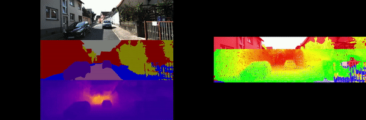
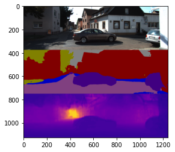

### Multi Task Learning for 3D segmentation

Perception stack of an Autonomous Driving system often contains multiple neural networks working together to predict bounding boxes, segmentation maps, depth maps, lane lines etc. Having a separate neural network for each task creates an heavy impact on system's processing speed. 

This repository contains implementation of a multi task learning based neural network presented in [1]. The attempt is to implement an architecture that has an encoder decoder structure. It takes RGB image as an input and predicts a segmentation mask and a depth map in a single forward pass. The idea is to have a common backbone for extracting feature map. Then according to the required task decoder structure are plugged on to this encoder to generate predictions. This sort of networks are essential for Autonomous Driving.

### Architecture

Model architecture can be understood by perceiving it as an encoder decoder structure.

**For Encoder** : A lightweight MobileNet V2 was used. Feature maps are extracted from multiple levels of the network. These feature maps are concatenated during upsampling to the layer outputs in decoders at corresponding levels

**For Decoder** : A lightweight RefineNet architecture was used which contains CRP blocks. The decoder consistently upsamples feature maps from encoder. Before the penultimate layer level, decoder splits into two heads for segmentation mask of input image and depth of image.

### Dataset:

Model has been tested with KITTI and NYU-D dataset. Both datasets provide set of RGB Image, Segmentation Mask and Depth Map for each data point.

### Results:

The model was tested on KITTI scenes for highway and residential drives. As an output model predicts a segmentation map and a depth map in a single forward pass. The segmentation mask and the depth map can be fused using libraries like Open3D to create a Point Cloud representation of 3D objects in each scene. We can not only get classification and pixel coordinates of each object in the image but we can also go a step ahead and compute their depth from the vehicle in real world.

Another way these results can be interpreted is in the form of a point cloud of depth segmentation map. Open3D has functionality to reproduce a full fledged Point Cloud using RGB and Depth image pair.

**Model Input/output**:

**3D Segmentation point cloud**:

**References**
[1] Real-Time Joint Semantic Segmentation and Depth Estimation Using Asymmetric Annotations
Vladimir Nekrasov, Thanuja Dharmasiri, Andrew Spek, Tom Drummond, Chunhua Shen, Ian Reid
In ICRA 2019 (https://arxiv.org/pdf/1809.04766.pdf)
